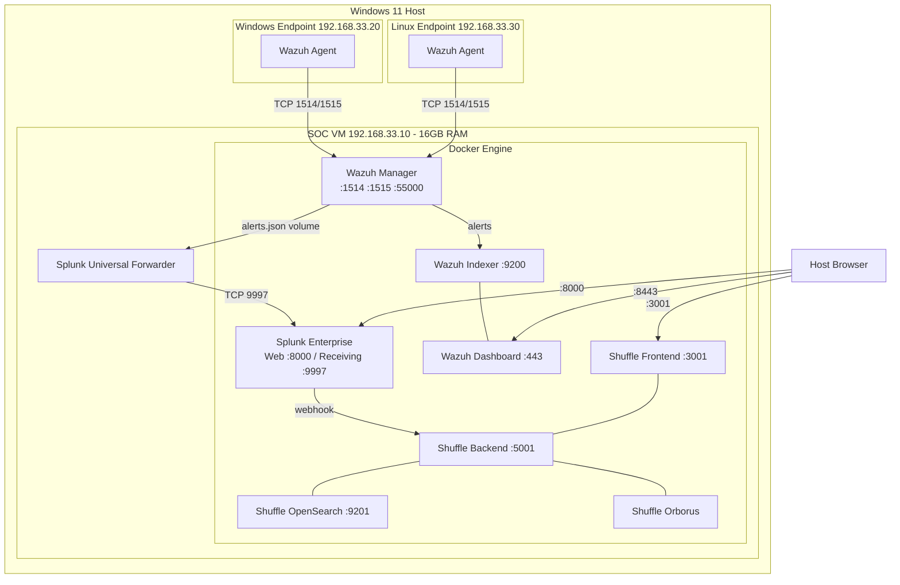

# SOC Engineering Lab

An automated Security Operations Center built entirely as code. This lab deploys a fully integrated security stack — Wazuh, Splunk, and Shuffle SOAR — across three virtual machines using Vagrant and Docker. A single `vagrant up` provisions the entire environment from scratch with zero manual steps.

## Architecture



> Splunk Universal Forwarder runs on the SOC VM. Host Browser represents access from the Windows 11 host machine.

## Stack

| Component | Role | Version |
|---|---|---|
| Wazuh Manager | Endpoint detection, alert correlation, active response | 4.14.4 |
| Wazuh Indexer | OpenSearch-based alert storage | 4.14.4 |
| Wazuh Dashboard | Security visibility UI | 4.14.4 |
| Splunk Enterprise | SIEM — correlation, hunting, analytics | 10.2.2 |
| Splunk Universal Forwarder | Log pipeline — Wazuh alerts to Splunk | 10.2.2 |
| Shuffle SOAR | Security orchestration and automated response | latest |
| Vagrant | VM provisioning and lifecycle management | 2.4.9 |
| VirtualBox | Hypervisor | 7.2.x |
| Docker | Container runtime for SOC services | latest |

## Vagrant Boxes

| Box | Used for | Source |
|---|---|---|
| `filipovo/windows-11-enter-eval-25H2` | Windows endpoint | Published on Vagrant Cloud. Built from the official Microsoft Windows 11 Enterprise Evaluation ISO (25H2, Build 26100) using the bento Packer project with VirtualBox provider. |
| `bento/ubuntu-25.04` | SOC VM and Linux endpoint | Community box maintained by the bento project. |

## Infrastructure

Three virtual machines are provisioned automatically:

**SOC VM** (`192.168.33.10`, 16GB RAM, 100GB disk, 4 vCPUs) runs the full security stack inside Docker — Wazuh single-node deployment, Splunk Enterprise, Shuffle SOAR, and the Splunk Universal Forwarder as a host service. Uses `bento/ubuntu-25.04`.

**Windows Endpoint** (`192.168.33.20`, 4GB RAM, 2 vCPUs) runs Windows 11 Enterprise Evaluation (25H2) with Wazuh agent installed and enrolled automatically during provisioning. Uses `filipovo/windows-11-enter-eval-25H2` from Vagrant Cloud.

**Linux Endpoint** (`192.168.33.30`, 2GB RAM, 2 vCPUs) runs Ubuntu 25.04 with Wazuh agent installed and enrolled automatically during provisioning. Uses `bento/ubuntu-25.04`.

## Prerequisites

**Host machine:**
- Windows 11 with at least 32GB RAM (lab allocates ~22GB across all VMs)
- [VirtualBox 7.2+](https://www.virtualbox.org/wiki/Downloads) with Extension Pack
- [Vagrant 2.4.9+](https://developer.hashicorp.com/vagrant/downloads)
- [Git](https://git-scm.com/)

**Accounts:**
- Splunk account for Universal Forwarder download — free registration at [splunk.com](https://www.splunk.com/en_us/download/universal-forwarder.html). The download URL is set in the Vagrantfile provisioner.

**Vagrant boxes downloaded automatically on first `vagrant up`:**
- `filipovo/windows-11-enter-eval-25H2` (~8GB)
- `bento/ubuntu-25.04` (~1GB)

## Quick Start

```bash
# Clone the repository
git clone https://github.com/filipperichta/soar-lab.git
cd soar-lab

# Create configuration files from examples
cp secrets.rb.example secrets.rb
cp config.rb.example config.rb

# Edit secrets.rb and set your Splunk password
# Edit config.rb if you need to change network or port settings

# Bring up the full lab
vagrant up
```

Provisioning takes approximately 30-45 minutes on first run due to Docker image downloads. Subsequent `vagrant up` after `vagrant halt` is significantly faster as images are cached on the VM disk.

## Configuration

### secrets.rb

Contains sensitive values that are never committed to git:

```ruby
SPLUNK_PASSWORD = "your-secure-password-here"
```

### config.rb

Contains network and port configuration. Modify if you have conflicts on your host machine:

```ruby
# Network
SOC_IP = "192.168.33.10"
WIN_ENDPOINT_IP = "192.168.33.20"
LINUX_ENDPOINT_IP = "192.168.33.30"

# Host ports — change these if you have conflicts
SPLUNK_WEB_PORT = 8000
SPLUNK_RECEIVING_PORT = 9997
WAZUH_DASHBOARD_PORT = 8443
WAZUH_API_PORT = 55000
WAZUH_INDEXER_PORT = 9200
WAZUH_AGENT_COMMS_PORT = 1514
WAZUH_AGENT_ENROLLMENT_PORT = 1515
SHUFFLE_HTTP_PORT = 3001
SHUFFLE_HTTPS_PORT = 3443
```

## Accessing Services

Once `vagrant up` completes, allow 5 minutes for all services to fully initialize before accessing them.

| Service | URL | Default Credentials |
|---|---|---|
| Splunk Web | http://localhost:8000 | admin / your SPLUNK_PASSWORD |
| Wazuh Dashboard | https://localhost:8443 | admin / SecretPassword |
| Shuffle SOAR | http://localhost:3001 | Set on first login |

Verify Wazuh alerts are flowing into Splunk:
```
index="wazuh-alerts"
```

## Architectural Decisions

### Wazuh alongside Splunk rather than Splunk alone

Splunk has no native endpoint agent capability. Wazuh provides what Splunk cannot — agent-based file integrity monitoring, rootkit detection, active response, vulnerability scanning, and CIS benchmark compliance checking running directly on endpoints. Rather than shipping raw Windows Event Logs to Splunk (which would exhaust the 500MB/day free tier instantly), Wazuh pre-processes and enriches endpoint telemetry before forwarding only correlated, MITRE ATT&CK-tagged alerts. This mirrors real enterprise deployments where Splunk licensing costs — charged per GB/day ingested — make intelligent pre-filtering an operational necessity.

### Splunk Universal Forwarder over Logstash

Wazuh Manager writes enriched alerts to `/var/ossec/logs/alerts/alerts.json` automatically. The Universal Forwarder reads this file directly and ships it to Splunk — no additional service, no transformation pipeline, no extra RAM consumption. Logstash would add another service layer, additional memory overhead, and a pipeline language to maintain without providing meaningful benefit for this use case. The forwarder approach is also more representative of enterprise SOC deployments.

### Patching official Shuffle docker-compose rather than maintaining a fork

Shuffle's official `docker-compose.yml` is cloned directly from the repository and two targeted `sed` patches are applied at provisioning time — one to resolve a port conflict with Wazuh's OpenSearch on `9200`, and one to reduce the OpenSearch heap size from `3072m` to `1024m` for lab RAM constraints. This approach means upstream changes to the official compose file are automatically inherited, reducing maintenance burden to just two documented patch lines rather than a full fork that diverges over time.

### Separate configuration files over inline heredocs

Splunk Universal Forwarder configuration (`inputs.conf`, `props.conf`, `outputs.conf`) is maintained as standalone files in `files/splunk-forwarder/` and copied into place during provisioning. Embedding these configurations as heredocs inside the Vagrantfile shell provisioner would introduce indentation-dependent whitespace into config files, making them harder to read, edit, and validate independently. Separate files are version-controlled, editable without touching the Vagrantfile, and follow the same separation-of-concerns principle applied to secrets and network configuration.

### Port variables in config.rb

All host-side port mappings are defined as named constants in `config.rb` rather than hardcoded throughout the Vagrantfile. Anyone cloning the lab can resolve port conflicts on their host machine by editing a single file. The constants are named after their function (`WAZUH_DASHBOARD_PORT`) rather than their value, making the Vagrantfile self-documenting.

### Secrets and configuration separation

Sensitive values (`SPLUNK_PASSWORD`) live in `secrets.rb`. Non-sensitive configuration (IP addresses, port numbers) lives in `config.rb`. Both are excluded from git via `.gitignore` with corresponding `.example` files committed as templates. This distinction matters — secrets require protection, configuration is just convenience. Conflating them into a single file obscures which values actually need securing.

### Custom Windows 11 Vagrant box

The `filipovo/windows-11-enter-eval-25H2` box was built from the official Microsoft Windows 11 Enterprise Evaluation ISO using the bento Packer project rather than using a community box of unknown provenance. This provides a documented, reproducible build process and a known baseline. The box is published on Vagrant Cloud for use by anyone cloning this lab. An alternative approach using `gusztavvargadr/windows-11` is available if you prefer not to use the custom box — change the `win.vm.box` value in the Vagrantfile.

## Known Limitations

**Splunk free license — 500MB/day ingestion.** Sufficient for lab use with Wazuh pre-filtering, but would require a paid license in production or under sustained attack simulation load.

**Windows 11 Vagrant box requires manual EFI step during Packer build.** When building the `filipovo/windows-11-enter-eval-25H2` box from source using the included Packer template, the EFI shell requires a manual Enter keypress to continue the boot sequence — a known open issue in the bento project with VirtualBox and Windows 11. The published box on Vagrant Cloud works correctly; only the Packer build process requires this intervention.

**LVM expansion via shell provisioner.** Vagrant's `config.vm.disk` resizes the virtual disk at the VirtualBox level but does not expand the Linux partition table or LVM logical volume inside the guest OS. A shell provisioner handles this using `growpart`, `pvresize`, `lvextend`, and `resize2fs`. While this mirrors standard practice in cloud environments (AWS EBS volume resizes require the same steps inside the instance), it is an acknowledged workaround for a Vagrant limitation rather than a native solution.

**Shuffle OpenSearch heap reduced to 1024MB.** The official Shuffle docker-compose allocates 3072MB to its OpenSearch instance. This has been reduced to 1024MB to accommodate running alongside Wazuh's full stack and Splunk Enterprise on a 16GB VM. Performance is acceptable for lab use. Increase `OPENSEARCH_JAVA_OPTS` in the patched compose file if you have more RAM available.

**Swap disabled persistently.** OpenSearch components (both Wazuh Indexer and Shuffle OpenSearch) require swap to be disabled for correct operation. The provisioner disables swap for the current session and comments out the swap entry in `/etc/fstab` to prevent it from re-enabling on reboot. This affects the entire SOC VM.

**Wazuh agent MANAGER_IP environment variable.** On Ubuntu 25.04 with Wazuh 4.14.4, the `WAZUH_MANAGER` environment variable passed during `apt-get install` is not applied to the agent configuration file. The provisioner works around this by using `sed` to replace the `MANAGER_IP` placeholder in `/var/ossec/etc/ossec.conf` directly after installation.

## Development Notes

Use `vagrant halt` rather than `vagrant destroy` to preserve downloaded Docker images between sessions. Images only re-download on `vagrant destroy`, which should be reserved for testing full provisioning from scratch.

```bash
vagrant halt              # Stop all VMs, preserve state and Docker images
vagrant up                # Resume all VMs
vagrant halt soc          # Stop only the SOC VM
vagrant destroy -f        # Destroy all VMs — full rebuild on next vagrant up
vagrant destroy soc -f    # Destroy only the SOC VM
vagrant reload --provision soc  # Restart SOC VM and rerun provisioners
```
