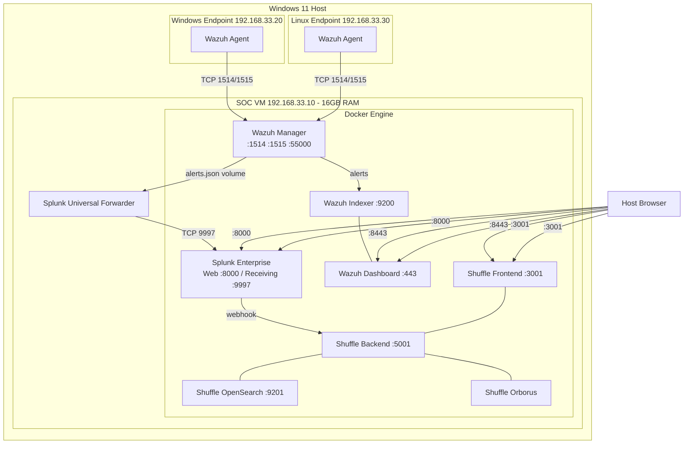

## Architecture

```mermaid
graph TB
    BROWSER["Host Browser"]

    subgraph HOST["Windows 11 Host"]
        subgraph WIN["Windows Endpoint 192.168.33.20"]
            WAZUH_WIN["Wazuh Agent"]
        end
        subgraph LIN["Linux Endpoint 192.168.33.30"]
            WAZUH_LIN["Wazuh Agent"]
        end
        subgraph SOC["SOC VM 192.168.33.10 - 16GB RAM"]
            UF["Splunk Universal Forwarder"]
            subgraph DOCKER["Docker Engine"]
                SPLUNK["Splunk Enterprise\nWeb :8000 / Receiving :9997"]
                WAZUH_MGR["Wazuh Manager\n:1514 :1515 :55000"]
                WAZUH_IDX["Wazuh Indexer :9200"]
                WAZUH_DSH["Wazuh Dashboard :443"]
                SHUFFLE_FE["Shuffle Frontend :3001"]
                SHUFFLE_BE["Shuffle Backend :5001"]
                SHUFFLE_OS["Shuffle OpenSearch :9201"]
                SHUFFLE_OR["Shuffle Orborus"]
            end
        end
    end

    WAZUH_WIN -->|TCP 1514/1515| WAZUH_MGR
    WAZUH_LIN -->|TCP 1514/1515| WAZUH_MGR
    WAZUH_MGR -->|alerts| WAZUH_IDX
    WAZUH_IDX --- WAZUH_DSH
    WAZUH_MGR -->|alerts.json volume| UF
    UF -->|TCP 9997| SPLUNK
    SPLUNK -->|webhook| SHUFFLE_BE
    SHUFFLE_BE --- SHUFFLE_OS
    SHUFFLE_BE --- SHUFFLE_OR
    SHUFFLE_FE --- SHUFFLE_BE
    BROWSER -->|:8000| SPLUNK
    BROWSER -->|:8443| WAZUH_DSH
    BROWSER -->|:3001| SHUFFLE_FE

    BROWSER -->|:8000| SPLUNK
    BROWSER -->|:8443| WAZUH_DSH
    BROWSER -->|:3001| SHUFFLE_FE
```
